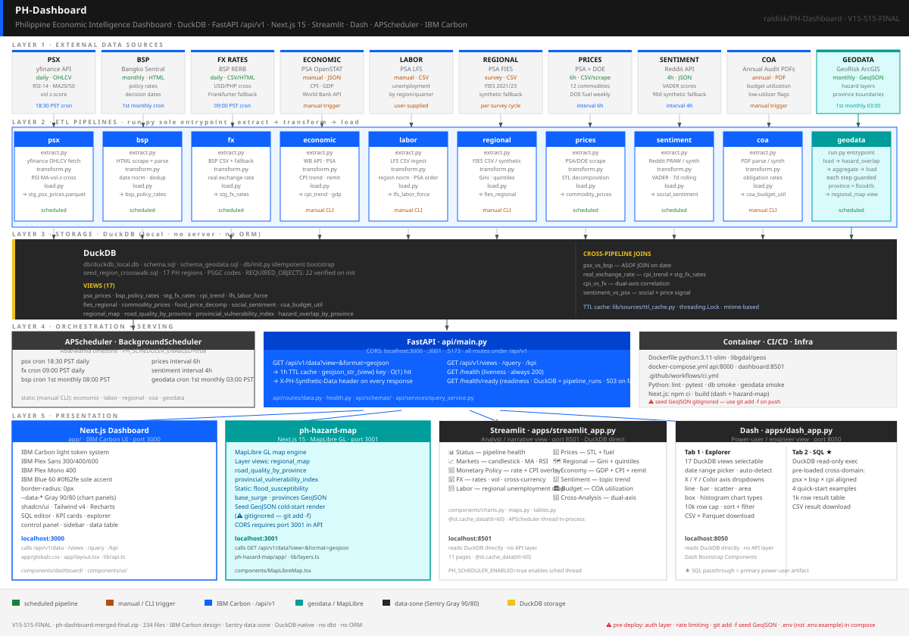

# PH Economic Intelligence Dashboard

[](https://www.python.org/)
[](https://duckdb.org/)
[](https://fastapi.tiangolo.com/)
[](https://nextjs.org/)
[](https://streamlit.io/)
[](LICENSE)

> **Philippine Economic Intelligence Dashboard** — a locally-hosted, multi-domain analytics platform integrating ten Philippine economic datasets into a unified DuckDB-backed dashboard with four presentation clients.

Data flows from nine public government and market sources through ETL pipelines into a local DuckDB store, orchestrated by APScheduler, served by FastAPI, and visualised in Next.js, Streamlit, and Dash.

---

## Part of the Philippine Financial Data Platform

| Repository | Role | Port |
|---|---|---|
| [econ-intel-platform](https://github.com/raldisk/econ-intel-platform) | Unified intelligence hub — downstream consumer of all enrichment edges | 8001 |
| [ph-macro-lakehouse](https://github.com/raldisk/ph-macro-lakehouse) | Gold-layer macro data pipeline — FX rates and macro indicators via Parquet/S3 | 8000 |
| [psx-equity-analytics](https://github.com/raldisk/psx-equity-analytics) | PSX equity microstructure analytics — VWAP, Amihud illiquidity, SARIMA trend | 8004 |
| [bsp-credit-risk-warehouse](https://github.com/raldisk/bsp-credit-risk-warehouse) | BSP Circular 855 regulatory credit exposure DWH — monthly closed-period serving | 8003 |
| [iso20022-settlement-engine](https://github.com/raldisk/iso20022-settlement-engine) | ISO 20022 pacs.008 interbank settlement ledger — daily bilateral PHP flow serving | 8002 |

Each repository is independently deployable and self-sufficient. Cross-repo data flows are optional enrichment edges — any repository operates fully without its peers. Connections activate only when the corresponding environment variable is configured.

**This repository** is the hub consumer. It optionally draws enriched data from all four peers:
- [`ph-macro-lakehouse`](https://github.com/raldisk/ph-macro-lakehouse) → gold-layer FX rates and macro indicators (`MACRO_LAKEHOUSE_URL`)
- [`psx-equity-analytics`](https://github.com/raldisk/psx-equity-analytics) → VWAP, Amihud, SARIMA analytics per PSX ticker (`PSX_ANALYTICS_API_URL`)
- [`bsp-credit-risk-warehouse`](https://github.com/raldisk/bsp-credit-risk-warehouse) → monthly BSP credit exposure by closed period (`CREDIT_RISK_API_URL`)
- [`iso20022-settlement-engine`](https://github.com/raldisk/iso20022-settlement-engine) → daily interbank settlement PHP flow, consumed indirectly via `psx-equity-analytics`

Fallback: when any peer is unreachable or its env var is unset, the embedded BSP/PSA/yfinance pipeline runs instead with no degradation.

## Table of Contents

- [Ecosystem](#ecosystem)
- [Repository Layout](#repository-layout)
- [Architecture](#architecture)
- [Quick Start](#quick-start)
- [Service Endpoints](#service-endpoints)
- [Running the Pipelines](#running-the-pipelines)
- [API Reference](#api-reference)
- [Configuration](#configuration)
- [Data Gaps and Fallbacks](#data-gaps-and-fallbacks)
- [Development](#development)
- [Scheduled Pipelines](#scheduled-pipelines)
- [Failure Modes](#failure-modes)
- [Tech Stack](#tech-stack)

---

## Repository Layout

```
PH-Dashboard/
├── config.py            ← single source of truth for all paths, TTLs, and URLs
├── pipelines/           ← nine ETL pipeline modules (uniform extract/transform/load/run interface)
├── api/                 ← FastAPI — read-only DuckDB serving layer
├── scheduler/           ← standalone APScheduler process (decoupled from all frontends)
├── apps/                ← Streamlit (11 pages) + Dash (explorer + SQL passthrough)
├── components/          ← shared Plotly factories, table helpers, map components
├── lib/                 ← DuckDB helpers, shared HTTP source clients, view registry
├── db/                  ← schema.sql DDL (22 objects) + idempotent bootstrap
├── app/                 ← Next.js 15 app directory (primary UI, port 3000)
├── components/dashboard/← Next.js dashboard components
├── components/ui/       ← shadcn/ui primitives
├── hooks/               ← React hooks
├── tests/               ← pytest unit and schema bootstrap tests
└── data/                ← raw/, processed/, cache/ (all gitignored)
```

`pipeline/` (Python + DuckDB) and `app/` (Node 20) use separate runtimes and cannot share a package manager. `make` is the single entry point that coordinates both.

---

## Architecture



Five layers: external data sources → ETL pipelines → DuckDB local storage → orchestration + FastAPI serving → four presentation clients.

**Key design rules:**
- DuckDB is the single store — all curated data lives as Parquet files registered as views; no separate database server required
- Only one read-write DuckDB connection is permitted at a time; `lib/db.get_write_conn()` is used exclusively by pipeline `load.py` files; all app code uses `get_read_conn()`
- The scheduler is a standalone process — it is never embedded in any frontend, ensuring pipeline execution survives Streamlit restarts and hot-reloads
- `lib/views.py` is the single source of truth for the API security allowlist (`ALLOWED_VIEWS`), chart axis defaults (`VIEW_AXIS_HINTS`), and synthetic-data disclosure (`synthetic_status()`)
- Every pipeline falls back to synthetic data when credentials or source files are absent — the dashboard is always fully operational

---

## Quick Start

**Prerequisites:** Python 3.11+, Node 20+.

```bash
git clone https://github.com/raldisk/ph-dashboard.git
cd ph-dashboard

# 1. Install Python and Node dependencies
pip install -e ".[dev]"
npm install

# 2. Bootstrap DuckDB schema (run once, or after wiping the database)
make init

# Wait for schema verification
# Expected: "All 22 required objects verified."

# 3. Populate DuckDB — run all nine ETL pipelines
make pipelines

# Verify pipeline output
python -c "
import duckdb, config as cfg
con = duckdb.connect(str(cfg.DB_PATH), read_only=True)
r = con.execute('SELECT COUNT(*) FROM psx_prices').fetchone()
print(f'psx_prices rows: {r[0]}')
con.close()
"
```

```bash
# ── Open separate terminals for each process ─────────────────────────────

# Terminal A: FastAPI (read-only DuckDB, required for Next.js)
make api           # → http://localhost:8000

# Verify API health
curl http://localhost:8000/health

# Terminal B: Standalone scheduler (pipeline writes, independent lifecycle)
make scheduler     # → python -m scheduler.main

# Terminal C: Next.js (primary UI)
make dev           # → http://localhost:3000

# Terminal D (optional): Streamlit narrative dashboard
make streamlit     # → http://localhost:8501
```

> ⚠️ **Startup order matters.** `make init` must complete before `api` or `scheduler`. The scheduler must run in a **separate terminal** — embedding it in any frontend process is not supported.

---

## Service Endpoints

| Service | URL | Notes |
|---------|-----|-------|
| Next.js Dashboard | http://localhost:3000 | Primary UI — SQL editor, KPI cards, view explorer |
| API + Swagger | http://localhost:8000/docs | FastAPI, read-only DuckDB |
| Streamlit | http://localhost:8501 | 11-page narrative dashboard, DuckDB direct |
| Dash Explorer | http://localhost:8050 | SQL passthrough, DuckDB direct |

---

## Running the Pipelines

```bash
# Run all pipelines via Makefile
make pipelines

# Or run each individually
python -m pipelines.psx.run        # PSX OHLCV + RSI/MA signals
python -m pipelines.bsp.run        # BSP monetary policy rates
python -m pipelines.fx.run         # FX rates + volatility
python -m pipelines.economic.run   # GDP, CPI, OFW remittances (static — run quarterly)
python -m pipelines.labor.run      # LFS labor market (requires manual CSV)
python -m pipelines.regional.run   # FIES regional inequality (synthetic fallback)
python -m pipelines.prices.run     # Commodity retail + DOE fuel (synthetic fallback)
python -m pipelines.sentiment.run  # Reddit VADER sentiment (synthetic fallback)
python -m pipelines.coa.run        # COA audit reports (synthetic fallback)

# Verify view registration
python -c "
import duckdb, config as cfg
con = duckdb.connect(str(cfg.DB_PATH), read_only=True)
views = con.execute(\"SELECT table_name FROM information_schema.tables WHERE table_type = 'VIEW'\").fetchall()
print(f'{len(views)} views registered:', [v[0] for v in views])
con.close()
"

# Check pipeline run log
python -c "
import duckdb, config as cfg
con = duckdb.connect(str(cfg.DB_PATH), read_only=True)
rows = con.execute('SELECT pipeline, status, run_at FROM pipeline_runs ORDER BY run_at DESC LIMIT 10').fetchall()
for r in rows: print(r)
con.close()
"

# Activate the Prefect monthly schedule (runs 1st of each month, 06:00 PST)
python -m scheduler.main
```

Every pipeline exposes the same four-function contract:

```python
def extract() -> None: ...   # writes to data/raw/
def transform() -> None: ... # writes Parquet to data/processed/
def load() -> None: ...      # registers DuckDB view
def run() -> None:
    extract(); transform(); load()
```

---

## API Reference

All endpoints are read-only. Base URL: `http://localhost:8000`

| Method | Path | Description |
|--------|------|-------------|
| `GET` | `/health` | Liveness probe — always `{"status": "ok"}` |
| `GET` | `/views` | All registered DuckDB views with column metadata |
| `GET` | `/views/meta` | View list + axis hints for the Next.js frontend |
| `GET` | `/data?view=<name>` | Fetch rows from a named view — optional `date_col`, `start`, `end`, `limit` |
| `POST` | `/query` | Execute a validated `SELECT` statement — max 10,000 rows |
| `GET` | `/kpi/{view}` | Four summary KPI stats (Latest, Maximum, Minimum, Average) via native DuckDB `MAX_BY` |
| `GET` | `/status` | Per-pipeline last run time, status, and synthetic-data disclosure |

---

## Configuration

### `config.py` — key overrides

All pipeline paths, TTLs, and optional data source paths are centralised in `config.py`. Import `cfg` anywhere — never hard-code paths.

```python
# Enable real labor data (PSA LFS)
LABOR_LFS_CSV: Optional[Path] = Path("data/raw/labor/lfs.csv")

# Enable real regional data (PSA FIES)
REGIONAL_DATA_DIR: Optional[Path] = Path("data/raw/regional/")

# Enable real prices (PSA Price Situationer + DOE)
PRICES_PSA_CSV: Optional[Path] = Path("data/raw/prices/psa_prices.csv")
PRICES_DOE_CSV: Optional[Path] = Path("data/raw/prices/doe_fuel.csv")

# Enable live sentiment (Reddit API)
# Set via environment variable — do not put credentials in config.py
# export REDDIT_CLIENT_ID=...
# export REDDIT_CLIENT_SECRET=...
# export REDDIT_USER_AGENT=...

# Enable COA budget data (PDF ingestion)
COA_PDF_DIR: Optional[Path] = Path("data/raw/coa/")
```

### `.env.local` — Next.js frontend

```dotenv
NEXT_PUBLIC_API_URL=http://localhost:8000   # empty = defaults to localhost:8000
```

---

## Data Gaps and Fallbacks

Quality rules and synthetic fallback behaviour are defined per-pipeline. All pipelines complete without error in fallback mode. The Next.js frontend renders a ⚠ disclosure banner on any view backed by a synthetic pipeline.

| Pipeline | Default | Fallback behaviour | To activate real data |
|----------|---------|--------------------|-----------------------|
| PSX | ✅ Live | — | yfinance (always live) |
| BSP | ✅ Live | — | BSP HTML scrape (always live) |
| FX | ✅ Live | — | BSP RERB + Frankfurter (always live) |
| Economic | ✅ Live | — | PSA OpenSTAT + World Bank API |
| Labor | ⚠ Empty schema | Zero-row `labor_market` view | Download [PSA LFS](https://psa.gov.ph/content/labor-force-survey-lfs), set `cfg.LABOR_LFS_CSV` |
| Regional | ⚠ Synthetic | PSA-anchored FIES (seeded) | Download [FIES CSVs](https://psa.gov.ph/statistics/income-expenditure), set `cfg.REGIONAL_DATA_DIR` |
| Prices | ⚠ Synthetic | PSA/DOE anchored (seeded) | Download [Price Situationer](https://psa.gov.ph/statistics/price-situationer) + [DOE bulletin](https://www.doe.gov.ph/weekly-retail-pump-prices), set `cfg.PRICES_PSA_CSV` / `cfg.PRICES_DOE_CSV` |
| Sentiment | ⚠ Synthetic | 90-day trailing VADER scores | Register [Reddit app](https://www.reddit.com/prefs/apps), set `REDDIT_CLIENT_ID` env var |
| COA | ⚠ Synthetic | FY2019–2023, 15 agencies | Download [COA AAR PDFs](https://www.coa.gov.ph/index.php/reports/annual-audit-reports), set `cfg.COA_PDF_DIR` |

---

## Development

### Backend (no Docker)

```bash
python -m venv .venv && source .venv/bin/activate   # Windows: .venv\Scripts\activate
pip install -e ".[dev]"
make init
uvicorn api.main:app --reload --port 8000
```

### Frontend (no Docker)

```bash
npm install
npm run dev   # http://localhost:3000
```

### Tests

```bash
# Unit tests — no infrastructure needed
pytest tests/unit/ -v

# Full suite — needs DuckDB bootstrapped (make init)
pytest tests/ -v

# Type-check the Next.js frontend
make typecheck   # npx tsc --noEmit
```

### Lint

```bash
ruff check . && black --check .
```

---

## Scheduled Pipelines

The scheduler runs as a standalone process (`make scheduler`) in Philippine Standard Time (UTC+8). A heartbeat file at `db/scheduler.heartbeat` is written every 60 seconds; the Streamlit Status page and the `/status` API endpoint read its mtime to detect a dead scheduler.

| Pipeline | Trigger | Schedule (PST) | Rationale |
|----------|---------|----------------|-----------|
| PSX | daily cron | 18:30 | PSE closes 15:30; yfinance cache settles ~3 h later |
| FX | daily cron | 09:00 | BSP publishes morning reference rates |
| BSP | monthly cron | 1st, 08:00 | Policy decisions are monthly |
| Prices | interval | every 6 h | DA/NFA bulletins update intra-day |
| Sentiment | interval | every 4 h | Reddit API rate limits constrain shorter cadence |

Static pipelines — run manually after each data release:
`economic` · `labor` · `regional` · `coa`

---

## Failure Modes

| Symptom | Cause | Fix |
|---------|-------|-----|
| `RuntimeError: Schema bootstrap incomplete` | `make init` not run, or schema.sql DDL error | Run `make init`; check `db/schema.sql` for syntax errors |
| `IOException: Could not open database` | Second process opened a read-write connection | Only pipeline `load.py` files use `get_write_conn()`; all app code must use `get_read_conn()` |
| Next.js chart blank, no errors | API not running or pipelines never executed | Start `make api`, then run `make pipelines` |
| `GET /data` returns 404 for a view | View name not in `ALLOWED_VIEWS` | Add to `db/init.py::REQUIRED_OBJECTS` and `lib/views.py::VIEW_AXIS_HINTS` |
| Scheduler jobs not firing | `make scheduler` not started, or duplicate registration | Start scheduler in a **separate terminal**; module-level `_scheduler` guard prevents re-registration |
| `HardQualityFailure` from lakehouse adapter | >5% rows failed lakehouse quality checks | Check `/datasets/{name}/quality` on the lakehouse, or fall back to embedded pipelines |
| Streamlit ⚠ banner on all views | Scheduler not running or pipelines not executed | Run `make pipelines`, then start `make scheduler` |
| `REDDIT_CLIENT_ID missing` — sentiment synthetic | Reddit credentials not set | Set `REDDIT_CLIENT_ID`, `REDDIT_CLIENT_SECRET`, `REDDIT_USER_AGENT` in environment |
| `UnsupportedClassVersionError` (Spark interop) | Java < 17 if using lakehouse locally | Install Java 17, set `JAVA_HOME` |

---

## Tech Stack

| Layer | Technology |
|-------|------------|
| Orchestration | APScheduler 3.x — standalone background process |
| Storage | DuckDB 0.10+ · Apache Parquet · PyArrow 14 |
| Data transforms | pandas · statsmodels (STL) · vaderSentiment |
| Ingestion | yfinance · httpx · BeautifulSoup4 · praw · pdfplumber |
| API | FastAPI 0.111 · uvicorn · Pydantic v2 |
| Python frontends | Streamlit 1.35+ · Dash + dash-bootstrap-components · Plotly |
| Primary UI | Next.js 15 · React 18 · TypeScript 5 · Tailwind CSS v4 |
| UI components | shadcn/ui · Radix UI · Recharts · lucide-react |
| Build | Vite 5 (dashboard) · npm / pnpm |
| Testing | pytest · ruff · black · tsc |

---

## License

See `ATTRIBUTION.md` for data source attributions and licensing notes.
